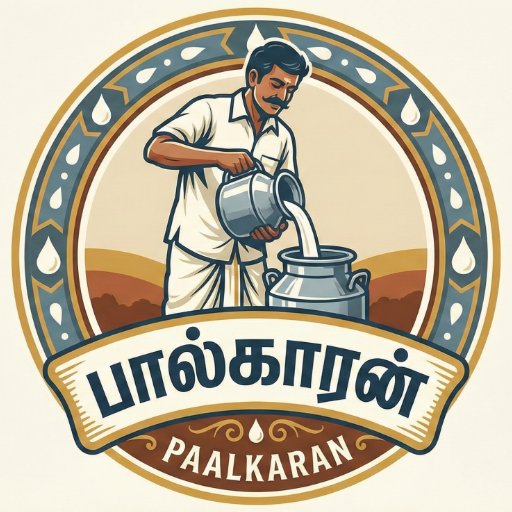

  

<h1 align="center">🥛 Paalkaaran</h1>

Simple &amp; Smart Milk Delivery Management App

  
  
  

---

## 📌 About

**Paalkaaran** is a milk delivery management app to track daily milk quantity, price, customer records, history, and totals.

It helps you manage:
- 🥛 Daily milk delivery
- 💰 Price calculation
- 👥 Customer records
- 📊 History tracking
- 📅 Date-wise entries

---

## ✨ Features

- 🧾 Daily Entry Tracking
- 💵 Automatic Price Calculation
- 👤 Customer Management
- 📆 Missed Day Handling
- 📊 History & Totals
- ⚡ Lightweight & Fast

---

## 📲 Installation

1. Get the APK file.
2. Enable **Install from Unknown Sources** (if prompted).
3. Install the app.
4. Open and start managing your milk business.

More details: [INSTALL.md](INSTALL.md)

---

## 📸 Screenshots

  
  
  

---

## 🔐 Privacy

- Works offline-first (no cloud sync by default).
- No personal data is uploaded from this APK.

---

## 📜 License

This project is licensed under the **MIT License** — see [LICENSE](LICENSE).

---

Made with ❤️ by S.G. Rathenesh

